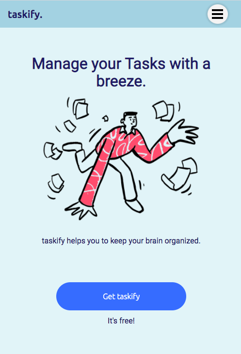
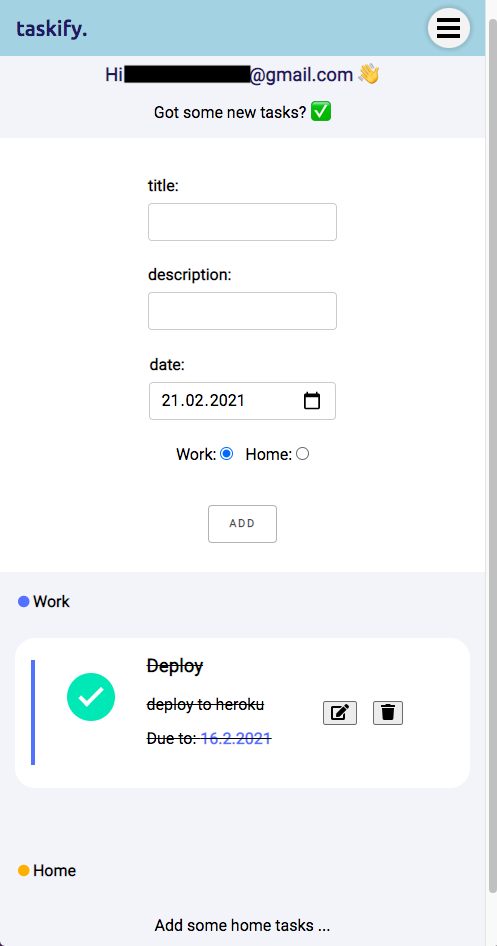

# Taskify - CRUD App built with Spring Data REST, OAuth2 and React

## [DEMO](https://enigmatic-everglades-34441.herokuapp.com/)

A web app to manage tasks.

 

This is a full stack CRUD App realised with Spring Data REST, OAuth2 (Google) and React for learning purposes. The project was (partly) 
bootstrapped using [this template](https://github.com/eder13/Spring-Boot-OAuth2-React-Project-Template) - check it out if you need information to run a built on your local machine.
